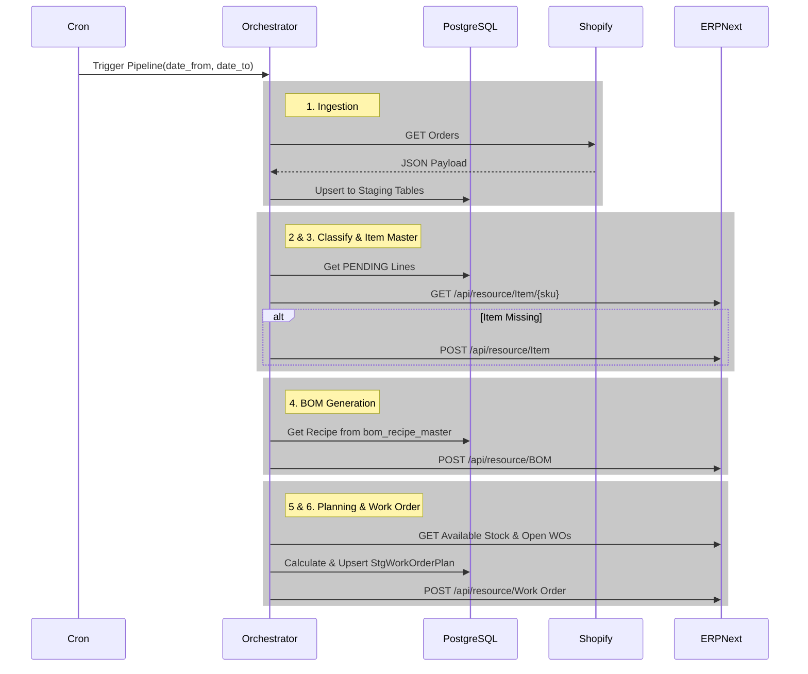

# Produce.Ai — Low Level Design (LLD)

## 1. Introduction
This document provides the low-level technical design for the Produce.Ai multi-agent manufacturing pipeline. It translates the business requirements (Shopify to ERPNext orchestration) into a scalable software architecture using LangGraph for agent orchestration, FastAPI for the backend, and PostgreSQL for state management.

## 2. Architecture Overview
Produce.Ai operates as a sequential, deterministic multi-agent workflow. The system state is maintained in a relational database (PostgreSQL), while the active pipeline state is passed between agents using a LangGraph `StateGraph`.

### 2.1 Technology Stack
- **Backend Core**: Python 3.x, FastAPI
- **Orchestration**: LangGraph (`StateGraph`)
- **Database**: PostgreSQL with SQLAlchemy (async) and Alembic
- **Integrations**: `httpx` based async clients for Shopify and ERPNext (Frappe REST API)
- **Frontend (Optional)**: HTML/CSS/JS Dashboard for Exception Monitoring

## 3. Database Schema (PostgreSQL)

The staging tables decouple the fast ingestion of Shopify data from the slower, strict ERPNext API.

* **`shopify_order_raw`**: `id`, `shopify_order_id`, `raw_payload` (JSON)
* **`stg_shopify_sales_order_hdr`**: `id`, `shopify_order_id`, `customer_email`, `total_price`, `financial_status`
* **`stg_shopify_sales_order_line`**: `id`, `hdr_id` (FK), `sku`, `quantity`, `processing_status` (PENDING, CLASSIFIED, ERROR)
* **`map_shopify_sku_erp_item`**: `id`, `shopify_sku`, `erp_item_code`
* **`bom_recipe_master`**: `id`, `fg_item_code`, `raw_material_code`, `qty`, `uom` (Source of truth for BOM creation)
* **`stg_work_order_plan`**: `id`, `planning_date`, `erp_fg_item_code`, `net_qty`, `status` (PENDING, CREATED, FAILED), `erp_work_order_id`
* **`exception_queue`**: `id`, `error_type`, `related_sku`, `description`, `status` (OPEN, RESOLVED)

## 4. Multi-Agent Workflow Details

The pipeline is modeled as a LangGraph `StateGraph`.

### State Object definition
```python
class AgentState(TypedDict):
    planning_date: datetime
    date_from: Optional[datetime]
    date_to: Optional[datetime]
    raw_orders: List[Dict[str, Any]]
    staged_order_ids: List[int]
    classified_skus: List[str]
    exceptions: List[Dict[str, Any]]
```

### Agent Nodes
1. **Ingestion Node**: Fetches orders (paid and unpaid) using `date_from` and `date_to`. Upserts into staging tables. If an order exists but changed from 'pending' to 'paid', it updates the header status.
2. **Classification Node**: Reads PENDING lines. Validates `sku`. Updates status to CLASSIFIED. Flags missing SKUs to the exception queue.
3. **Item Master Node**: Checks ERPNext for classified SKUs. Creates missing Finished Goods items via Frappe API (`is_stock_item=1`, `item_group="Finished Goods"`).
4. **BOM Generation Node**: Deterministically reads from `bom_recipe_master`. If missing, invokes Anthropic's Claude 3 Haiku via LangChain to dynamically propose a BOM recipe (materials and quantities) which requires human review. Creates default BOMs using the auto-generated ERP item codes.
5. **Planning Node**: The MRP engine. Calculates: `Net Qty = Open Paid Demand - Available Stock - Open WO Qty`. Upserts positive net quantities into `stg_work_order_plan` using the mapped `erp_item_code`.
6. **Work Order Node**: Reads PENDING plans and POSTs them to the ERPNext `/api/resource/Work Order` endpoint using the mapped `erp_item_code`.
7. **Exception Node**: Consolidates all `exceptions` logged in the state and triggers external alerts (e.g., logging, Slack webhooks).

## 5. Sequence Diagram



## 6. Integration and Security
- **API Keys**: Shopify and ERPNext secrets are injected via environment variables (`.env`).
- **Transactional Safety**: All local database mutations use SQLAlchemy async sessions with proper `.commit()` / `.rollback()` boundaries to ensure staging data consistency.
- **Idempotency**: The Ingestion Agent deduplicates orders. The Planning Agent aggregates demand safely based on the current `planning_date` avoiding duplicate Work Orders.
