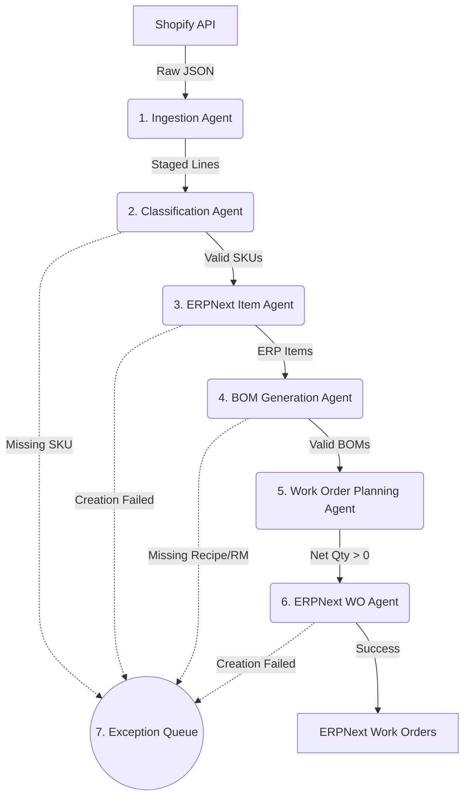

# Produce.Ai Pipeline Stages and Outcomes

This document maps out the complete 7-stage multi-agent pipeline derived from the manufacturing blueprint. It details exactly what each stage is responsible for and the resulting output (data changes or ERPNext actions) it produces.

## Pipeline Flow

## Detailed Stage Outcomes

| Stage | Agent Name | Core Action | Expected Outcome / Output |
| :--- | :--- | :--- | :--- |
| **1** | **Ingestion Agent** | Pulls all orders from Shopify via API within a date range (paid or unpaid) and checks for duplicates. Updates status of existing orders if payment clears. | **Data Staged:** Populates `shopify_order_raw`, `stg_shopify_sales_order_hdr`, and `stg_shopify_sales_order_line` tables. |
| **2** | **Classification Agent** | Validates SKUs on staged lines and filters out non-manufacturing items (like shipping). | **Line Tagging:** Updates lines with `processing_status = CLASSIFIED`. **Exception:** Pushes lines with missing/blank SKUs to the exception queue. |
| **3** | **Item Master Agent** | Checks ERPNext for the SKU. If it doesn't exist, it creates a new Finished Goods (FG) item. | **ERP Alignment:** Guarantees an FG item exists in ERPNext for every ordered SKU. Retrieves the auto-generated Item Code (`STO-ITEM-...`) and stores it in `map_shopify_sku_erp_item` for downstream use. |
| **4** | **BOM Generation Agent** | Checks ERPNext for a default BOM. If missing, strictly reads `bom_recipe_master`. If not found there, invokes an LLM to propose a BOM dynamically. | **BOM Created:** A valid BOM exists in ERPNext. **Exception:** If raw materials are missing in ERPNext, it halts and flags an exception. Requires human review if BOM is AI-proposed. |
| **5** | **Planning Agent** | Consolidates demand per SKU per day. Runs MRP formula: *Net Qty = Open Paid Demand - Available Stock - Open WO Qty*. Only calculates using orders marked as `paid`. | **Plan Created:** If Net Qty > 0, it upserts a row into `stg_work_order_plan` for that day. |
| **6** | **Work Order Agent** | Reads the pending plans and executes the creation via Frappe REST API. | **Final Output:** A physical Work Order is created in ERPNext. Saves the returned WO Number back to staging. |
| **7** | **Exception Agent** | Monitors failures across all previous stages (missing data, API errors). | **Alerting:** Populates the `exception_queue` table, which drives the frontend dashboard alerts for manual intervention. |

> [!NOTE] 
> **The Golden Rule:** The pipeline is designed to fail gracefully. If any step (like missing a BOM) fails for a specific SKU, that SKU is pushed to the Exception Agent, but the rest of the pipeline continues processing the other valid SKUs for the day.
